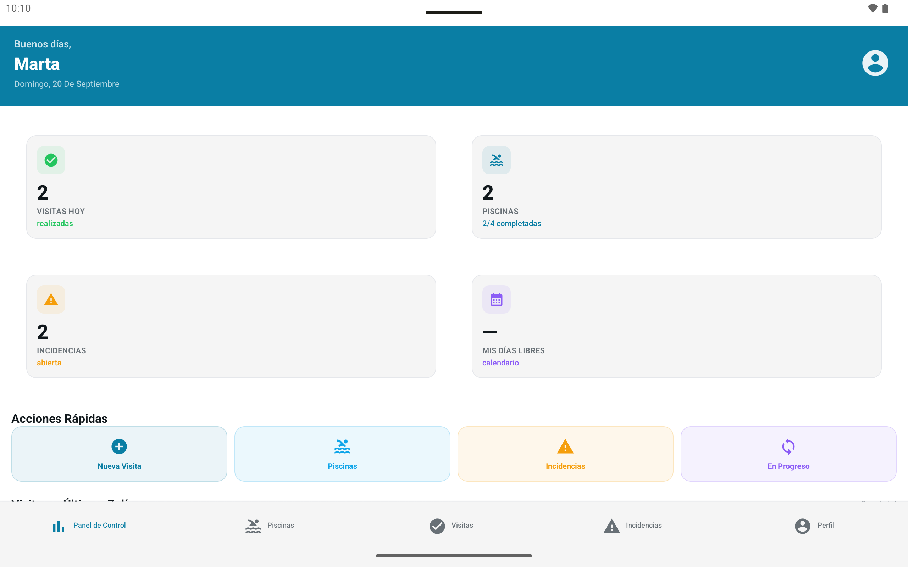
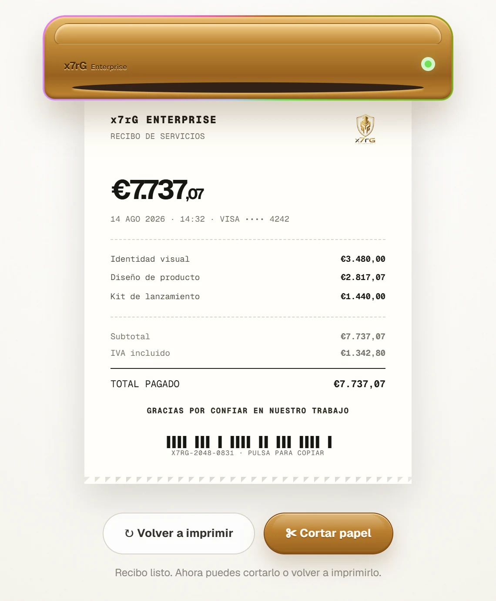
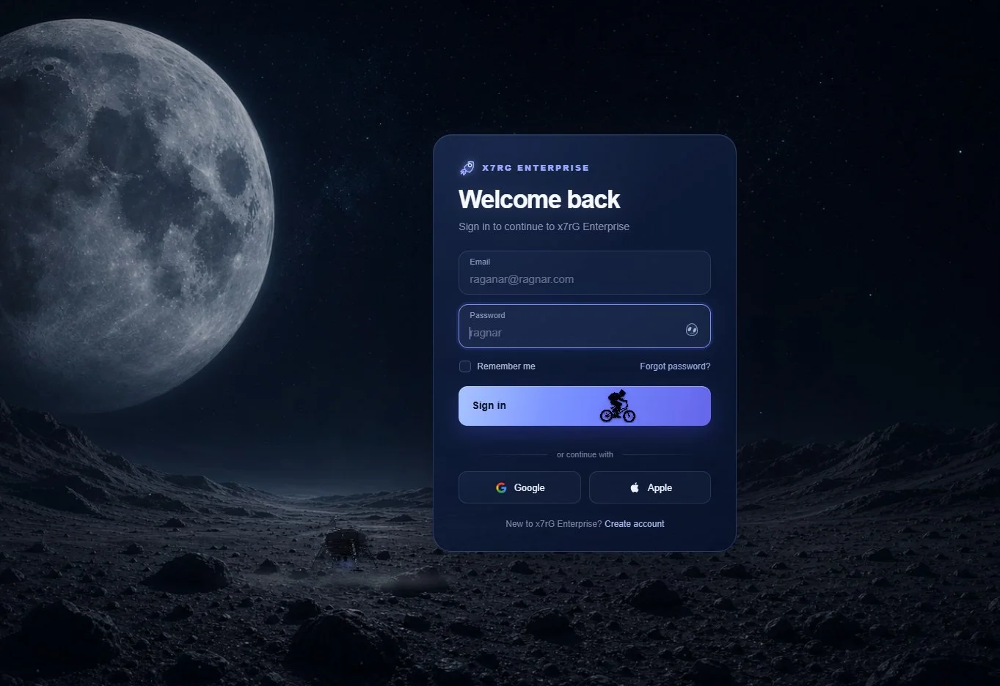
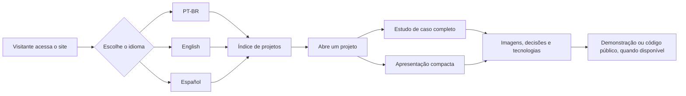

<div align="center">
  

  # x7rG Portfolio

  [](https://github.com/xx7rg/x7rg-portfolio/actions/workflows/ci.yml)

  **Portfólio multilíngue de Rogério Gomes — Developer × Graphic Designer.**

  [](https://nextjs.org/)
  [](https://react.dev/)
  [](https://www.typescriptlang.org/)
  
  

  **Publicado por x7rG ENTERPRISE™**

  [Ver portfólio online](https://x7rg-portfolio.contato-rgsantos.workers.dev)
</div>

---


## Sobre o projeto

Este site reúne aplicativos, jogos, sites, identidades visuais e experiências interativas criados por **Rogério Gomes**. Cada trabalho abre dentro do próprio portfólio e apresenta contexto, imagens reais, decisões de projeto, tecnologias, demonstrações disponíveis e limites conhecidos.

O portfólio foi construído como uma experiência editorial responsiva. Ele oferece rotas próprias em português, inglês e espanhol, navegação por links diretos para cada projeto, visualizador de mídia acessível e exportação estática para hospedagem em CDN.

## Projetos em destaque

<table>
  <tr>
    <td width="50%" valign="top">
      
      <h3>AquaControl</h3>
      <p>Organiza o trabalho de campo, a supervisão e a administração de uma empresa de manutenção de piscinas em um único fluxo operacional.</p>
    </td>
    <td width="50%" valign="top">
      
      <h3>Recibo Digital</h3>
      <p>Transforma a emissão de um recibo demonstrativo em uma experiência direta no navegador, sem armazenar dados em um back-end.</p>
      <p><a href="https://recibo-digital.contato-rgsantos.workers.dev">Abrir demonstração</a> · <a href="https://github.com/xx7rg/Recibo-Digital">Ver código</a></p>
    </td>
  </tr>
  <tr>
    <td width="50%" valign="top">
      
      <h3>Login The Moon</h3>
      <p>Mostra como uma tela de acesso pode ganhar narrativa, movimento e resposta ao ponteiro sem perder sua função principal.</p>
      <p><a href="https://xx7rg.github.io/Login-The-Moon/">Abrir demonstração</a> · <a href="https://github.com/xx7rg/Login-The-Moon">Ver código</a></p>
    </td>
    <td width="50%" valign="top">
      
      <h3>Feito Pela Bya</h3>
      <p>Dá nome, identidade visual, direção criativa e presença digital a um negócio real de trufas artesanais.</p>
    </td>
  </tr>
</table>

## Organização do portfólio

### Produtos e soluções operacionais

- **AquaControl** — aplicativo interno para campo, supervisão e administração de manutenção de piscinas.
- **Neon Blockfall** — jogo para Android com identidade neon própria, atualmente em teste fechado.
- **DiscordCameraLive** — adaptação do GoLiveBypass para restaurar Go Live e câmera no Discord.

### Projetos para negócios reais

- **Feito Pela Bya** — identidade de marca e site para um negócio de trufas artesanais.
- **Adriano Reformas Vigo** — site responsivo para um serviço local de reformas em Vigo.
- **Luciane Correa Servicios** — site de serviços domésticos com depoimentos moderados e back-end na Cloudflare.

### Experiências e demonstrações de portfólio

- **Login The Moon** e **Light Login** exploram narrativas e interações em telas de acesso.
- **Checkout** estuda uma interface educativa de pagamento com React, TypeScript e CSS 3D; não processa pagamentos.
- **Recibo Digital** simula a impressão de um recibo diretamente no navegador.
- **Matteo** apresenta um convite afetivo com ambientes de dia, tarde e noite, galeria e informações da celebração.

## Como funciona



Os projetos são cadastrados em `src/content/projects.ts`. O campo `kind` define se a entrada abre um estudo de caso completo ou uma apresentação compacta. O hash da URL preserva o projeto aberto ao trocar de idioma e permite compartilhar links diretos como `/pt#light-login`.

## Tecnologias

- Next.js 16 com App Router e exportação estática
- React 19 e TypeScript
- Tailwind CSS 4
- Motion para animações e respostas de interface
- CSS Modules e container queries para as composições responsivas
- Metadados, sitemap, robots, imagens Open Graph e rotas localizadas

## Executar localmente

Requisitos: **Node.js 22 ou mais recente** e npm. Os testes de comportamento
usam o WebSocket nativo do Node e precisam de Edge ou Chrome instalado.

```bash
git clone https://github.com/xx7rg/x7rg-portfolio.git
cd x7rg-portfolio
npm ci
npm run dev
```

Abra [http://localhost:3000/pt](http://localhost:3000/pt).

## Comandos validados

| Comando | Finalidade |
| --- | --- |
| `npm run dev` | Inicia o ambiente de desenvolvimento. |
| `npm run typecheck` | Gera os tipos de rotas do Next.js e valida o TypeScript. |
| `npm run lint` | Executa o ESLint. |
| `npm run build` | Gera a exportação estática na pasta `out`. |
| `npm run preview` | Serve localmente a pasta `out` em `http://127.0.0.1:3000`. |
| `npm run check:behavior -- --quick` | Verifica idiomas, responsividade, abertura dos casos, histórico, mídia e interações principais. Requer `npm run dev` ou `npm run preview` em outro terminal. |
| `npm run check:approved` | Confere o manifesto visual interno quando ele estiver presente; no clone público, informa `SKIP`. |
| `npm run test:security` | Testa a proteção local contra recursão excessiva em `braces`. |
| `npm run audit:dev` | Executa os testes de segurança e audita toda a árvore, aceitando apenas o alerta coberto pelo patch local. |

Para testar o build de produção:

```bash
npm run build
npm run preview
```

Em outro terminal:

```bash
npm run check:behavior -- --quick
```

## Validação automática e segurança

O CI verifica tipos, lint, o manifesto visual quando disponível, o build e as
interações no navegador. A auditoria de produção bloqueia alertas altos e críticos.
No Linux do CI, o Chrome roda em uma tela virtual com Xvfb (`--headed`), para
que os testes de mouse e hover tenham as capacidades de um navegador desktop.
O comando local mantém o modo headless por padrão.

O patch `patches/braces+3.0.3.patch` é aplicado automaticamente na instalação
e limita a profundidade de padrões e dos percursos recursivos. A instalação falha
se o patch não puder ser aplicado. O `npm audit` original ainda lista
[GHSA-vfj7-8cjw-p6xm](https://github.com/advisories/GHSA-vfj7-8cjw-p6xm),
porque consulta a versão publicada, sem analisar a correção local.
`npm run audit:dev` exige que os testes dessa proteção passem e aceita somente
esse alerta específico; qualquer outro alerta bloqueia o CI. O patch e a exceção
devem ser removidos quando houver uma versão oficial corrigida.

## Estrutura principal

```text
src/
├── app/                  # rotas, metadados e páginas localizadas
├── assets/               # imagens reais dos projetos e da marca
├── components/           # interface, estudos de caso e interações
├── content/              # catálogo e dados independentes de idioma
├── i18n/                 # dicionários PT-BR, EN e ES
└── lib/                  # utilitários de URL, histórico e composição
scripts/
├── approved.mjs          # proteção das superfícies visuais aprovadas
├── behavior.mjs          # testes de comportamento no navegador
└── preview.mjs           # servidor local da exportação estática
```

## Publicação

O `next.config.ts` usa `output: "export"`; por isso o artefato de produção é a pasta `out`. O site é publicado automaticamente pelo GitHub na Cloudflare: **[abrir o portfólio](https://x7rg-portfolio.contato-rgsantos.workers.dev)**. O repositório também mantém integrações de implantação com a Vercel.

As fontes do Google são resolvidas durante o build. O ambiente de compilação precisa ter acesso à internet para baixá-las.

## Autoria

Desenvolvido por **x7rG Enterprise** — [@_7Ragnar](https://github.com/xx7rg) · [LinkedIn](https://www.linkedin.com/in/rgds/)

---

<div align="center">
  <p>© 2026 x7rG ENTERPRISE™ — Todos os direitos reservados.</p>
  <p>
    <a href="https://www.linkedin.com/in/rgds/"></a>
    <a href="https://www.instagram.com/_7ragnar"></a>
  </p>
</div>
